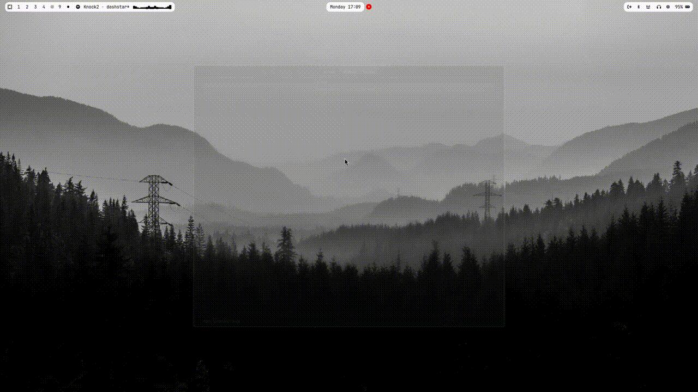

# PingLine
A simple, cross-platform, TUI-based notification manager.


## Features
- TUI-based
- Cross-platform
- Notifications from multiple sources
- Images from posts
- Lightweight and fast

## Supported notification sources
- Youtube
- Twitter
- Bluesky
- Tumblr
- Time
- Timer
- RSS 1.0 and 2.0
- Atom 1.0

## Installation
### Requirements
- .NET 8

### Releases
Pre-built binaries are available in the GitHub Releases tab.

### Build from source
```
git clone https://github.com/Schaapie-D2/PingLine.git
cd PingLine/src
dotnet build
dotnet run
```

## Usage
For adding new pings:
```
newping <type> <id>
```
Examples:
```
newping youtube FavoriteYoutuber
newping time WorkTime
```
Run `help` inside the application to see all commands.

# Roadmap
- [ ] More notification sources
- [ ] More customization